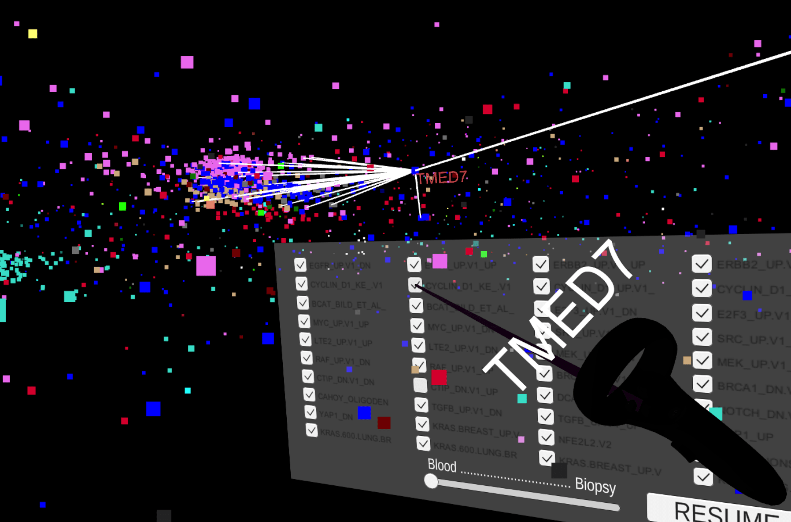
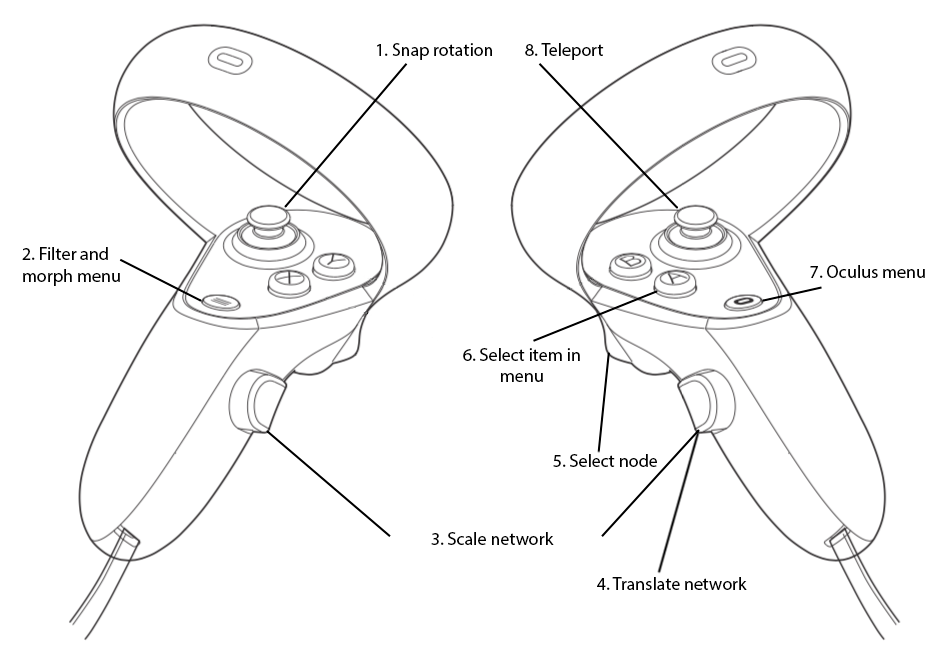

# GeneNet VR

GeneNet VR is a prototype of a bioinformatics VR application for the Oculus Quest to visualize large biological networks. It uses two datasets from MIxT as a case study. MIxT is a web application for interactive data exploration in system biology developed by UiT and Concordia University. MIxT provides an [interactive 2-dimensional view](https://mixt-tumor-stroma.bci.mcgill.ca/network) for networks. In this project we use Virtual Reality to solve problems related to the visualization of large biological networks, such as: information overload, high interconnectivity, and high dimensionality.

A video showing the application can be viewed here on YouTube: https://www.youtube.com/watch?v=_Iqa3yizYZ4

## Installation

Clone the repository locally and open it with Unity using the 2018.4.10f1 version. You can run it on your Oculus Quest by using the Oculus Link or by creating an .apk file in order to run the application on the Oculus Quest hardware.

## Usage

GeneNet VR uses the Oculus Quest controllers to interact with the biological networks. These are the different actions that we can use, check the image above for a reference on how to use them with the controllers.

## Contributing
Pull requests are welcome. For major changes, please open an issue first to discuss what you would like to change.
